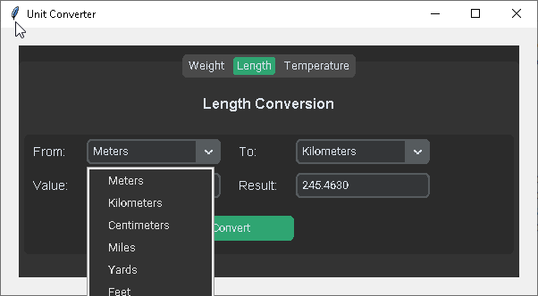
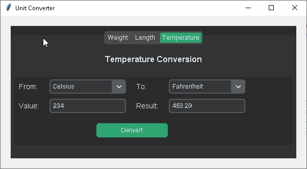
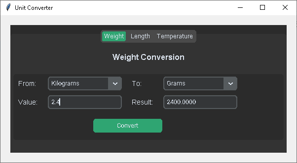

# Unit Converter with Python Tkinter

This is a simple Unit converter built using Python, Tkinter and CustomTkinter for the GUI. The applications allows user to convert from one unit of measurement to another in Length, Weight and Temperature. The project demonstrates a more advanced design of GUI programming, and Python logic.

## Demo





Watch the full video tutorial on YouTube: [Unit Converter with Python Custom Tkinter](https://www.youtube.com/watch?v=g-Ud-0HFZao)

## Features
- Length unit conversion 
- Weight unit conversion
- Temperature unit conversion


## Technologies Used
- Python
- Tkinter (for the graphical user interface)


## How to Run

1. **Clone the repository:**
   ```bash
   git clone https://github.com/Andrew-oduola/unit-converter-with-custom-tkinter-python
   ```

2. **Navigate to the project folder:**
   ```bash
   cd unit-converter-with-custom-tkinter-python
   ```

3. **Install customtkinter:**
    ```bash
    pip install customtkinter
    ```
    or

    ```bash
    pip3 install customtkinter
    ```

4. **Run the application:**
   ```bash
   python unit_converter.py
   ```

Make sure you have Python installed. Tkinter is inbuilt in python but you will have to install custom tkinter


